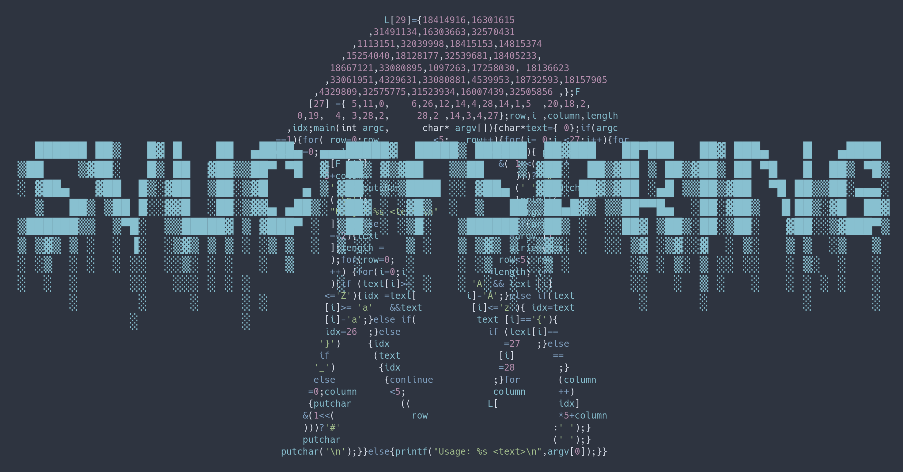

<div align="center">

# SVUCTF-SPRING-2024

Powered by GZCTF and GZTIME



</div>

## 说明

本仓库用于存储和构建 SVUCTF-SPRING-2024 的题目镜像、题解。

欢迎各位选手以 Pull Request 的形式提交自己的 write-up 。

若大家对本题解有任何疑问或改进建议，欢迎提 issue 。

比赛时间：北京时间 2024 年 6 月 26 日 09:00 ～ 7 月 4 日 09:00（共 9 天）

## 目录

- [题目](#%E9%A2%98%E7%9B%AE)
    - [Misc](#Misc)
    - [Reverse](#Reverse)
    - [Web](#Web)
    - [PPC](#PPC)
- [难度与分值](#%E9%9A%BE%E5%BA%A6%E4%B8%8E%E5%88%86%E5%80%BC)
- [往届比赛](#%E5%BE%80%E5%B1%8A%E6%AF%94%E8%B5%9B) [致谢](#%E8%87%B4%E8%B0%A2)

项目结构遵循 GZCTF 规范。

```
.github/workflows/
    └── <category>.<name>.yml
assets/                             # 资源文件，比如封面图
challenges/                         # 所有题目
    ├── web/                            # 题目分类
    │   ├── challenge1/                     # 题目
    │   │   ├── build/                          # 构建文件
    │   │   │   ├── Dockerfile
    │   │   │   └── more...
    │   │   ├── attachments/                    # 附件
    │   │   ├── writeup/                        # 题解文件    
    │   │   └── README.md                       # 题目信息（含题解文本）
    │   └── more...
    └── more...
```

## 题目

### Misc

|                    题目描述与题解                    | 难度  |                    文件、源代码                     |                                          镜像                                          |   出题人    |
| :-------------------------------------------: | :-: | :-------------------------------------------: | :----------------------------------------------------------------------------------: | :------: |
| [签到](challenges/misc/moe_obfuscate/README.md) |  -  | [文件、源代码](challenges/misc/moe_obfuscate/build) |                                          -                                           | 13m0n4de |
|  [cowsay](challenges/misc/cowsay/README.md)   |  -  |    [文件、源代码](challenges/misc/cowsay/build)     | [svuctf-spring-2024/cowsay](https://ghcr.io/svuctf/svuctf-spring-2024/cowsay:latest) | 13m0n4de |
|  [猫咪问答](challenges/misc/neko_quiz/README.md)  |  -  |   [文件、源代码](challenges/misc/neko_quiz/build)   | [svuctf-spring-2024/neko_quiz](https://ghcr.io/svuctf/svuctf-spring-2024/neko_quiz)  | 13m0n4de |
|   [危险的课设](challenges/misc/pickle/README.md)   |  -  |    [文件、源代码](challenges/misc/pickle/build)     |    [svuctf-spring-2024/pickle](https://ghcr.io/svuctf/svuctf-spring-2024/pickle)     | 13m0n4de |
|   [俄罗斯方块](challenges/misc/tetris/README.md)   |  -  |    [文件、源代码](challenges/misc/tetris/build)     |                                          -                                           | 13m0n4de |

### Reverse

|                         题目描述与题解                         | 难度  |                     文件、源代码                     |                                               镜像                                               |   出题人    |
| :-----------------------------------------------------: | :-: | :--------------------------------------------: | :--------------------------------------------------------------------------------------------: | :------: |
| [PIN Checker](challenges/reverse/pin_checker/README.md) |  -  | [文件、源代码](challenges/reverse/pin_checker/build) | [svuctf-spring-2024/pin_checker](https://ghcr.io/svuctf/svuctf-spring-2024/pin_checker:latest) | 13m0n4de |

### PPC

|                       题目描述与题解                        | 难度  |                 文件、源代码                 | 镜像  |   出题人    |
| :--------------------------------------------------: | :-: | :------------------------------------: | :-: | :------: |
| [Easy File System](challenges/ppc/easy_fs/README.md) |  -  | [文件、源代码](challenges/ppc/easy_fs/build) |  -  | 13m0n4de |

### Web

|                           题目描述与题解                           | 难度  |                     文件、源代码                     |                                                   镜像                                                   |   出题人    |
| :---------------------------------------------------------: | :-: | :--------------------------------------------: | :----------------------------------------------------------------------------------------------------: | :------: |
|          [帕鲁问答](challenges/web/pal_quiz/README.md)          |  -  |    [文件、源代码](challenges/web/pal_quiz/build)     |        [svuctf-spring-2024/pal_quiz](https://ghcr.io/svuctf/svuctf-spring-2024/pal_quiz:latest)        | 13m0n4de |
| [Jinja2 Renderer](challenges/web/jinja2_renderer/README.md) |  -  | [文件、源代码](challenges/web/jinja2_renderer/build) | [svuctf-spring-2024/jinja2_renderer](https://ghcr.io/svuctf/svuctf-spring-2024/jinja2_renderer:latest) | 13m0n4de |

## 难度与分值

本次比赛为训练赛，不区分难度，不标明分值。

## 往届比赛

- [SVUCTF-WINTER-2023](https://github.com/SVUCTF/SVUCTF-WINTER-2023) 破晓工作室 2023 冬季新生赛
- [SVUCTF-HELLOWORLD-2023](https://github.com/SVUCTF/SVUCTF-HELLOWORLD-2023) 破晓工作室 2023 招新赛

## 致谢

- [GZCTF](https://github.com/GZTimeWalker/GZCTF/)：比赛平台

## 许可证

该项目采用 GPL-3.0 许可证，查看 [LICENSE](LICENSE) 文件了解更多细节。
