# 猫咪问答

- 作者：13m0n4de
- 参考：-
- 难度：-
- 分类：Misc
- 镜像：[svuctf-spring-2024/neko_quiz](https://ghcr.io/svuctf/svuctf-spring-2024/neko_quiz)
- 端口：3000

## 题目描述

## 题目解析

题目形式仿照 [USTC-Hackergame-2023-猫咪小测](https://github.com/USTC-Hackergame/hackergame2023-writeup/blob/master/official/%E7%8C%AB%E5%92%AA%E5%B0%8F%E6%B5%8B/README.md)，可以去翻看一下历届的猫咪小测/猫咪问答，对这类搜索题目有进一步的了解。

上一次 SVUCTF 也有类似题型，但为了致敬你们某位学长，加了个背景，名字改成了[猫娘问答](https://github.com/SVUCTF/SVUCTF-WINTER-2023/blob/main/challenges/misc/neko_quiz/README.md)。

个人认为，这类搜索题比其他题目都要有用得多，信息收集能力 > 解决具体某种问题的能力，所以这次稍微稍微难了一点，而且不能通过分数推算出答案是否正确。

### 1. 想要在苏州图书馆借阅 Engineering a Compiler，需要到哪个分馆的哪个馆藏地点？（20 分）

> 1\. 想要在苏州图书馆借阅 Engineering a Compiler，需要到哪个分馆的哪个馆藏地点？（20 分）
>
> 提示：格式：所在分馆-所在馆藏地点，例如 中心馆-西文书库。（如有多个，任意一个即可）

进入苏州图书馆官网，从左上角搜索书名 `Engineering a Compiler`。

在搜索结果中，找到两处馆藏地点，都在 `苏图` 分馆，分别在 `北馆书库` 和 `设计图书馆`。

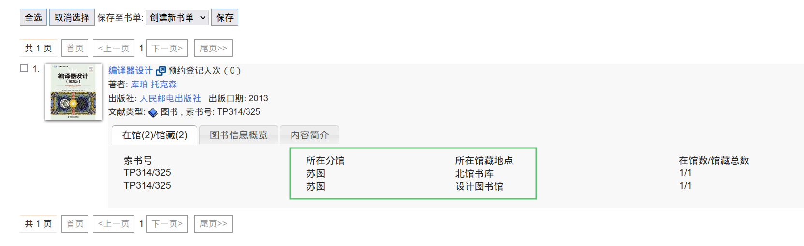

所以答案就是：`苏图-北馆书库` 或 `苏图-设计图书馆`。

### 2. 「你们这些搞计算机的，就是喜欢卖弄学问，数个数还得从零开始」。 其实编号从零开始是有道理的，一位计算机科学家还专门写过一篇简短的手写稿来解释， 请问这个手写稿的编写日期是？ （20 分）

> 2\. 「你们这些搞计算机的，就是喜欢卖弄学问，数个数还得从零开始」。 其实编号从零开始是有道理的，一位计算机科学家还专门写过一篇简短的手写稿来解释， 请问这个手写稿的编写日期是？ （20 分）
>
> 提示：格式：YYYY-MM-DD ，如 2024-02-05

问题可以猜解成两个部分，一个是「计算机为什么从零开始编号」，另一个是「哪个科学家就此写了一篇手写稿」。

分开搜索更容易得到答案，如果直接搜索 `从零编号 手写稿`，可能结果比较混乱。

搜索引擎中搜索 `计算机 编号从零开始`，可以得到一个维基链接：https://zh.wikipedia.org/zh-hans/%E5%BE%9E%E9%9B%B6%E9%96%8B%E5%A7%8B%E7%9A%84%E7%B7%A8%E8%99%9F

在起源一节中，可以看到 Edsger Wybe Dijkstra 写了一个相关的说明《为什么编号应该从零开始》。

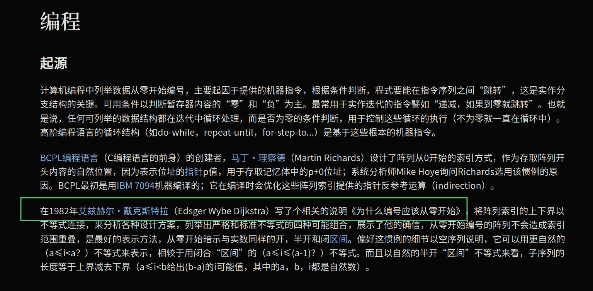

搜索 `为什么编号应该从零开始`，可以得到 MSE 实验室的一篇文章：http://www.mselab.cn/detail/126/

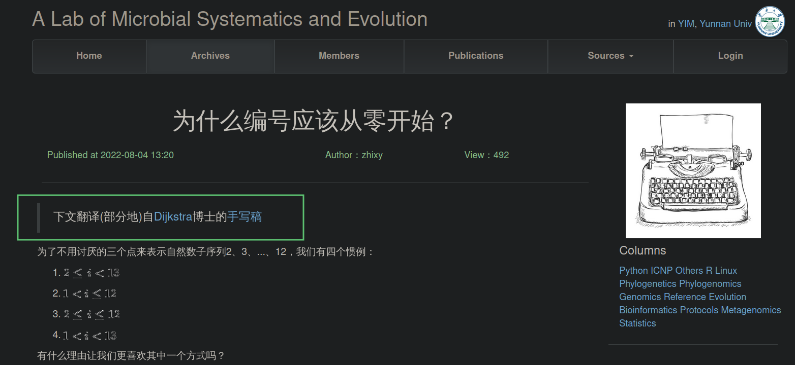

于是就得到了手写稿的地址：https://www.cs.utexas.edu/users/EWD/ewd08xx/EWD831.PDF

当然可能你也可以不从维基百科找到这份说明的名称，比如从这篇博客：https://docle.github.io/2018/08/26/Why-Numbering-Should-Start-At-Zero/

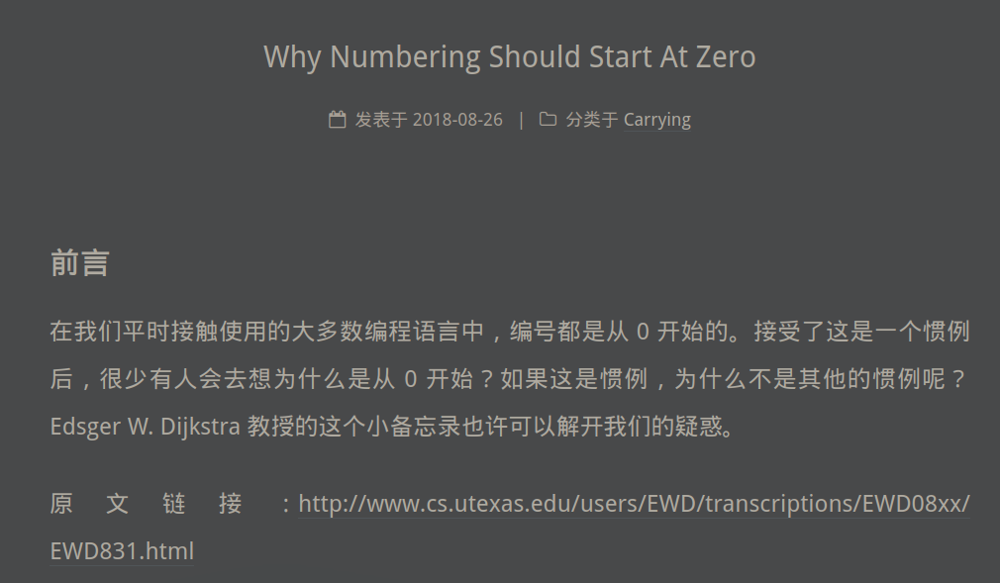

在手写稿 PDF 的最下方签名处，注明了当时的日期：

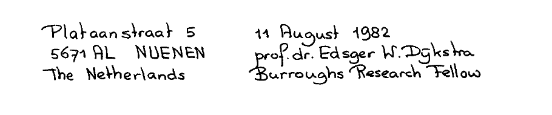

所以答案就是：`1982-08-11`

### 3. CVE-2023-45853 的修复补丁中，文件名长度被限制为多少位 (bit)？（20 分）

> 3\. CVE-2023-45853 的修复补丁中，文件名长度被限制为多少位 (bit)？（20 分）
>
> 提示：格式：整数，如 32

在 NVD 之类的网站上搜索 `CVE-2023-45853`，可以在资源列表里找到补丁链接。

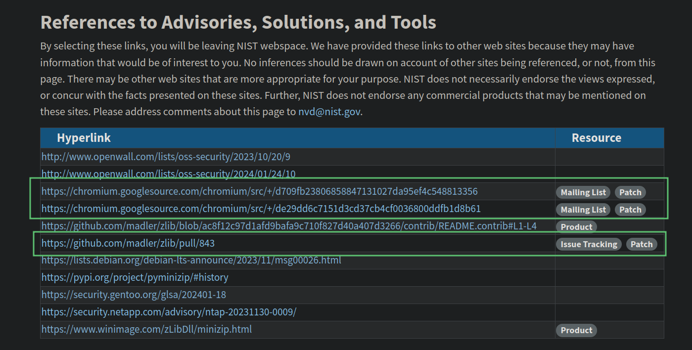

（当然你也可以直接搜索 `CVE-2023-45853 Patch`，也能得到补丁链接）

以 Github 仓库的补丁为例，https://github.com/madler/zlib/pull/843/files

清楚地写着限制为 `16-bit`：

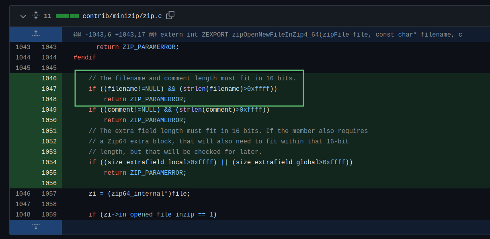

所以答案是：`16`

### 4. Hare 编程语言的官方风格指南中，行宽被限制为多少列？（20 分）

> 4\. Hare 编程语言的官方风格指南中，行宽被限制为多少列？（20 分）
>
> 提示：格式：整数，如 120

搜索 `Hare Programming Language` 进入官网：https://harelang.org。

首页没有风格指南，点击进入文档页面。

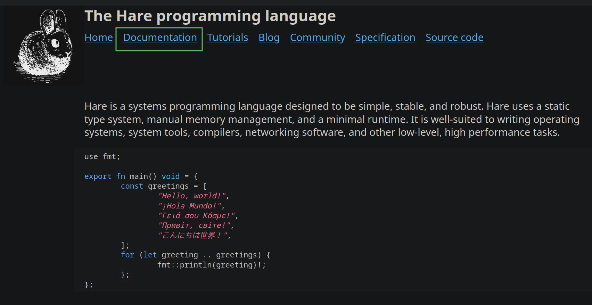

在文档页面搜索 `style guide`：

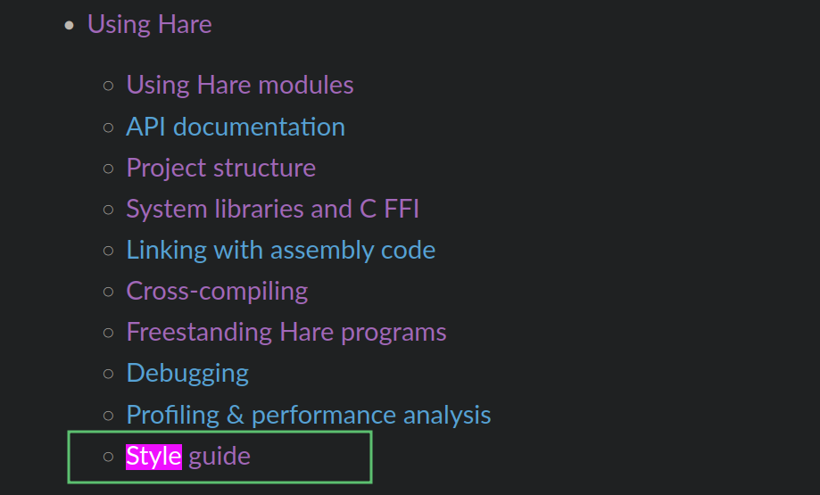

进入风格指南，搜索 `columns`，得到官方风格指南推荐行宽 80 列：

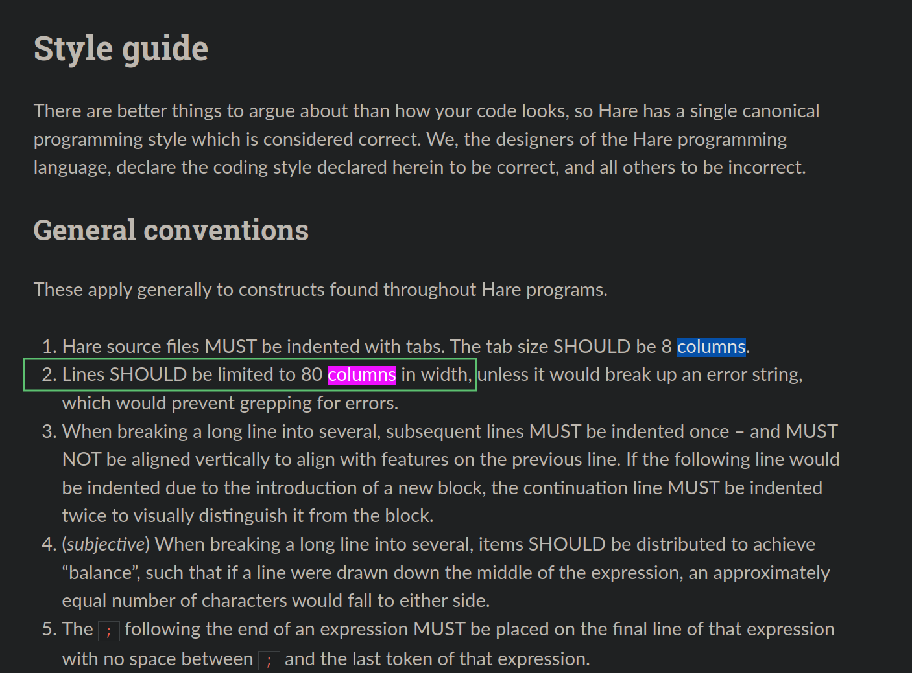

答案：`80`

（这题刚出完，Hare 就更新了官方文档，让风格指南变得更好搜了）

### 5. 在某次在线学术会议上，展示了一种通过声学侧信道推断 VoIP 呼叫来源的攻击手段， 请问这个会议的名称是？（20 分）

> 5\. 在某次在线学术会议上，展示了一种通过声学侧信道推断 VoIP 呼叫来源的攻击手段， 请问这个会议的名称是？（20 分）
>
> 提示：格式：会议名称 + 年份，以空格分割，如 ECOOP 2024

这题乍一看信息很多，其实可以分成几个关键点：

- 发表会议：线上的，可能是网络安全相关的；
- 攻击形式：声学侧信道；
- 攻击影响：推断 VoIP 呼叫来源。

会议已知信息太少，先从攻击方式的研究文章开始搜索比较准确，搜索 `acoustic side-channel VoIP` 可以找到一篇论文：

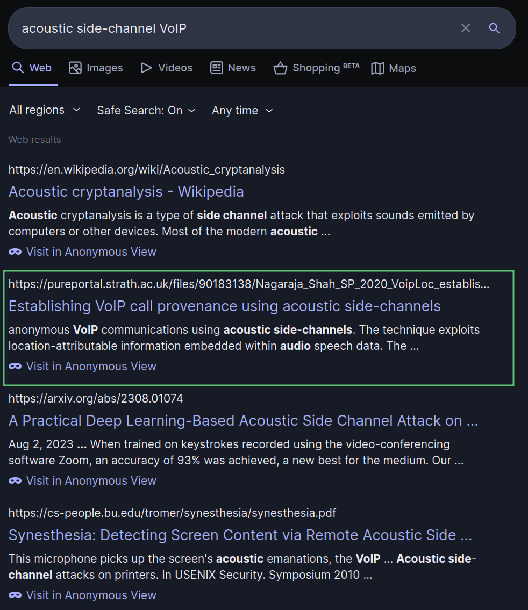

从论文标题得知，他们把这种攻击手段取名叫做 VoipLoc。

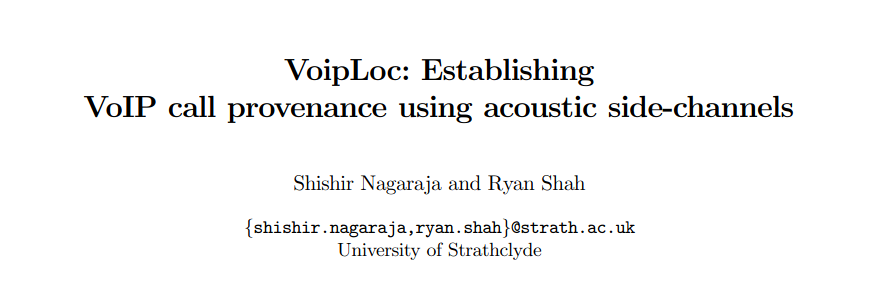

在 ACM Digital Library 中搜索 `VoipLoc`，找到论文发表的会议 WiSec：

可以得知它发表在 2021 年第十四届 WiSec 会议上。

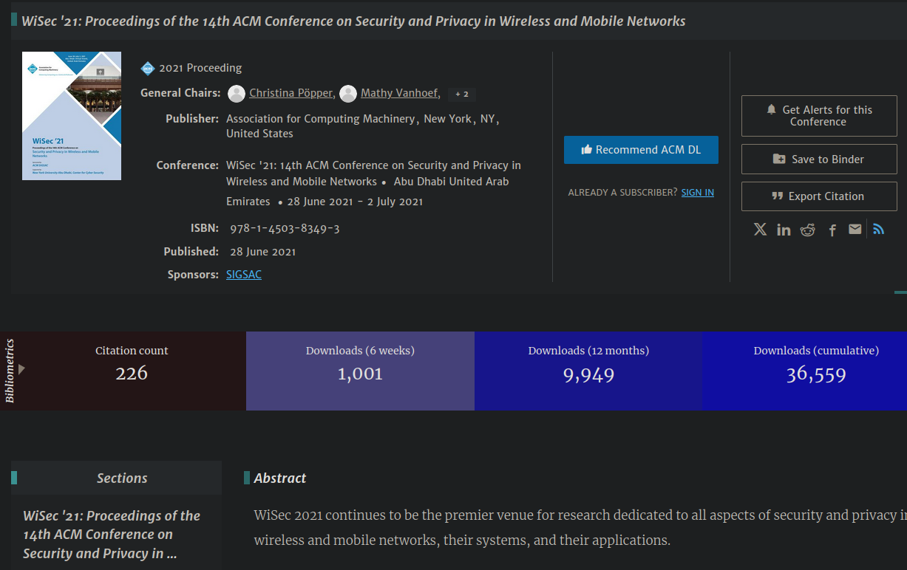

现在已经可以得出答案了：`ACM WiSec 2021` 或 `WiSec 2021`。

但题目特意强调线上会议，其实是希望更多几条途径可以找到答案。

比如从 YouTube 上，找到相关攻击的研究视频，翻到会议录像：

## 后话

出题 -> 验题 -> 开赛 -> 结赛 -> 写题解，每个环节都间隔了很长时间，其实这样对搜索题影响很大。

开赛前几天试验了几题，没有受到时间影响（甚至某些题目还更好搜了），至少是没有影响比赛期间的做题。

原本搜索题不太好让出题人写题解的，可能会有牵强的部分，或者先射箭再画靶的地方。

但写这篇题解的时候，距离出完题已经四个月了，我也差不多忘光光，算是重新做了一遍。所以，还行是么。
